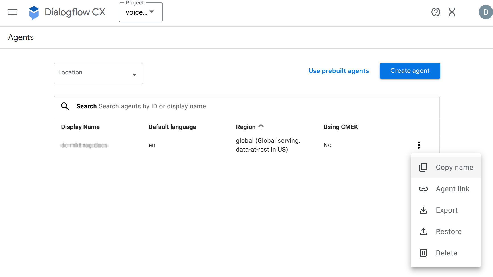
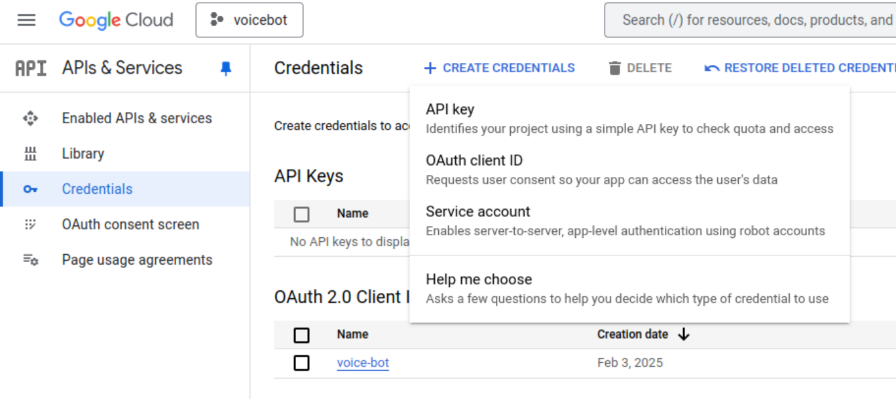
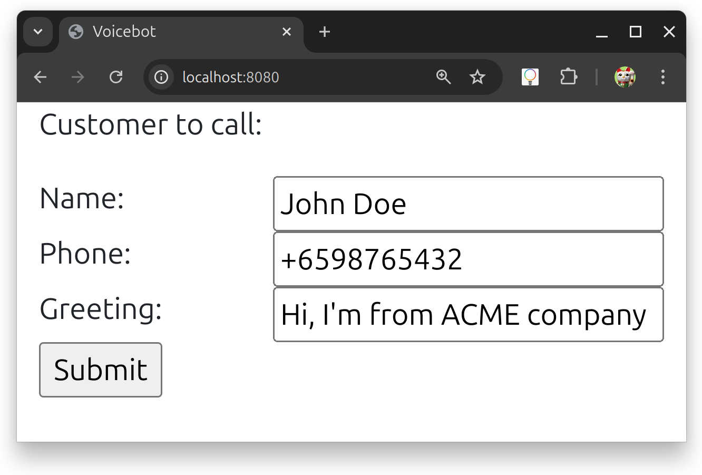

# voice-agent

This is a demo of a conversational agent that integrates Google cloud's Dialogflow CX, Speech (STT & TTS) with Twilio's telephony voice media streams. 

Dialogflow has built in support for Twilio, thus providing  functionality similar to this demo. What's different though, is that this demo interacts directly with Twilio's API, thus making it possible to get finer control over the telephony (e.g. make outbound calls with TWIML).

[YouTube](https://youtu.be/e21PqxPLJAo)

## Pre-requisites

* Twilio phone number
* Twilio API key
* Google Cloud service account key
* Google OAuth2 client ID (optional)
* ngrok (during development)

### Twilio

1. Get a [phone number](https://www.twilio.com/docs/phone-numbers).
2. From the [console](https://console.twilio.com) copy the "Account SID", "Auth Token" and "My Twilio phone number".
3. Set the environment variables TWILIO_ACCOUNT_SID, TWILIO_AUTH_TOKEN and TWILIO_PHONE_NUMBER respectively.

### Google Cloud

1. Create a project 
2. Enable "Agent Builder", "Cloud Speech-to-Text API", "Cloud Text-to-Speech API"
3. Set up a Service Account
4. Grant the necessary IAM rights for the Service Account
5. In "IAM & Admin" > "Organization Policies" , enable Service Account key creation by overriding "Disable service account key creation" policy.
6. Create a key for the Service Account, and store it as `./certs/creds.json`
7. Copy Project Id and Agent ID

Note: Agent ID can be found by clicking on the verticle elipsis and then selecting "Copy name"



### OAuth2



OAuth2 is enabled by default in the project. Follow the steps below to set it up:

1. Create an OAuth2 client ID in Google Cloud's "APIs & Services" > "Credentials" select "OAuth 2.0 Client IDs"
2. In "Authorized JavaScript origins" add "http://localhost:8080"
3. In "Authorized redirect URIs" add "http://localhost:8080/login/oauth2/code/google"
4. Copy the client's "Client ID" and "Client secret", and export them as environment variables `SPRING_SECURITY_OAUTH2_CLIENT_REGISTRATION_GOOGLE_CLIENT_ID` and `SPRING_SECURITY_OAUTH2_CLIENT_REGISTRATION_GOOGLE_CLIENT_SECRET` respectively.  

**⚠⚠⚠ WARNING ⚠⚠⚠**

The websocket listening on the route `/call-stream-websocket` for the Twilio callback, isn't protected as Twilio isn't able to provide a means to authenticate itself. It is recommended to restrict access to this endpoint by limiting IP addresses to Twilio's [edge locations](https://www.twilio.com/docs/global-infrastructure/edge-locations#twilio-docs-content-area).

### Disabling OAuth2

To disable OAuth2, the following dependencies must be removed from [pom.xml](./app/pom.xml)

* spring-security-web
* spring-security-config
* spring-security-oauth2-core
* spring-security-oauth2-client
* spring-security-oauth2-jose

Furthermore [OAuth2LoginSecurityConfig.java](./app/src/main/java/com/symplesys/voicebot/configuration/OAuth2LoginSecurityConfig.java) also has to be deleted.


### ngrok

To ease development, it is necessary to install [ngrok](https://ngrok.com), so that incoming websocket connections from Twilio can be relayed to a locally running instance of the demo.

As this demo will expose REST and websocket endpoints on port 8080, set up ngrok to relay external HTTPS calls to that port.

#### Sample `~/.config/ngrok/ngrok.yml`

```
version: 3
agent:
  authtoken: <authtoken>
endpoints:
  - name: default
    url: https://default.internal
    upstream:
      url: 8080

```

### Environment variables
|Variable|Description|
|-|-|
|TWILIO_ACCOUNT_SID| Twilio Account SID |
|TWILIO_AUTH_TOKEN| Twilio Account Auth token |
|TWILIO_PHONE_NUMBER| Twilio phone number |
|GOOGLE_APPLICATION_CREDENTIALS| Path to creds.json |
|GOOGLE_PROJECT_ID | Project ID |
|GOOGLE_AGENT_ID |The Dialogflow CX agent ID|
|USE_TELEPHONY | Flag to enable/disable telephony |
|SPRING_SECURITY_OAUTH2_CLIENT_REGISTRATION_GOOGLE_CLIENT_ID| Google OAuth 2.0 client ID |
|SPRING_SECURITY_OAUTH2_CLIENT_REGISTRATION_GOOGLE_CLIENT_SECRET| Google OAuth 2.0 client secret |


## Running

Start ngrok by invoking:

```
ngrok start default
```

### Locally

Within the ```./app``` folder, invoke:
```
mvn spring-boot:run
```


### Docker

Within the root folder, invoke:

```
docker compose up
```

### UI

Browse to web UI at `http://localhost:8080`




## Architecture 

See [Architecture](./app/README.md)