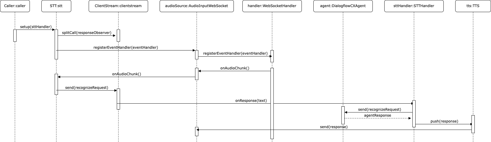

# Architecture

## Key components

* Audio sources
  * Twilio inbound media stream (websocket)
  * Local microphone
* Audio sinks
  * Twilio outbound media stream (websocket)
  * Local speaker
* Google Speech (TTS and STT)
* Google Dialogflow CX agent

## Use-case: Answer user's question

